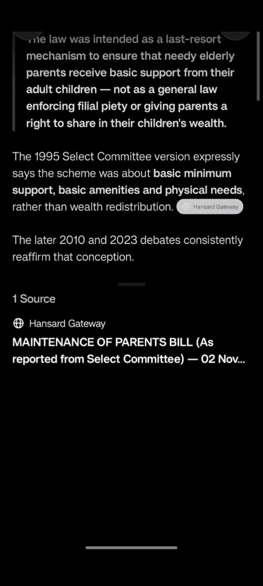

# sg-hansard-gateway

**Give any chat app access to Singapore Parliamentary Hansard over plain HTTP — no MCP server, no plugin, no SDK, no browser automation.**

sg-hansard-gateway is a **self-hosted** gateway: a single small Docker
container that your AI client talks to over ordinary `GET` requests. It is
not a hosted SaaS — you run it, you hold the tokens, and the gateway fetches
from the official Singapore Parliamentary Reports Service (SPRS) on your
client's behalf.

## 30-second explanation

1. Run the gateway (one container; it boots in an empty state and serves
   immediately).
2. Generate a capability token (`hg-tokens generate <label>` — the plaintext
   is printed once; only its SHA-256 digest is ever stored).
3. Hand the AI client your gateway URL + the token — and the short
   [client instruction sheet](docs/chat-instructions.md) when the client can
   only open URLs and follow links. That's it: **no client-side
   configuration** — nothing to install, register, or wire up inside the AI
   app.
4. The client searches Hansard, browses sittings by date, and reads full
   verbatim transcripts — each with a SHA-256 provenance footer and a link
   back to the official record.
5. Every result stays traceable to the official Parliamentary source; the
   official record remains the authoritative one.

"Three steps" is about the client. As the operator you do still deploy the
container, set `HANSARD_PUBLIC_BASE_URL`, create a token, and (for the local
term index) run a crawl — the quickstart below covers all of it.

## Demo

[](https://yuch85.github.io/sg-hansard-gateway/media/demo-chatgpt.mp4)
<sub><b>▶️ Watch the demo</b> (plays in a new tab · ~55 s · [mp4](media/demo-chatgpt.mp4), 7.1 MB)</sub>

The video is a screen recording of the exact documented flow: a constant
start URL pasted into **ChatGPT** (Mode 1), with no headless browser and no
URLs constructed by the client. ChatGPT answers from the gateway and cites
the report ids and SHA-256 footers it read. This is the only AI client
verified end-to-end; the design targets the capability envelope, not
ChatGPT specifically — see [Why two modes?](#why-two-modes).

## Why two modes?

AI clients have different web capabilities, and the gateway exposes the
same Hansard resource to both ends of that envelope:

- **Some clients can open a URL and follow rendered links, but cannot
  reliably construct arbitrary URLs** (ChatGPT's web tool is the reference
  case).
- **More capable agents can issue ordinary HTTP GET requests** (coding
  agents, API tools, curl).

Rather than pick one client or bolt on a per-client integration (MCP, a
plugin, an SDK), the gateway adds a thin interoperability layer: two access
modes over the same server-rendered content.

| | **Mode 1 — drop-in (click-only)** | **Mode 2 — direct GET** |
|---|---|---|
| For | Chat apps whose web tool can open a URL and follow links (ChatGPT is the reference client — see the [demo](#demo)) | More capable agents that can issue plain HTTP GETs (code tools, API tools) |
| How | Paste the [instruction sheet](docs/chat-instructions.md) with your URL + token. The client opens the start page `{your-url}/a/{token}/` and moves **only by following links rendered on the page** — it never constructs a URL | The same content as plain `GET`s: `/a/{token}/search?q=…`, `/a/{token}/date/YYYY-MM-DD`, `/a/{token}/report/REPORT_ID` |
| Setup | The sample sheet is [`docs/chat-instructions.md`](docs/chat-instructions.md) — paste PART A as-is (it's written to be dropped in as the first message or a system instruction) | Nothing to install; endpoints are documented inline in the sheet and in the public machine contract `{your-url}/openapi.json` |
| Trust | The client is fenced by the instructions ("never invent a URL") | No fence needed — the client is already programmatic |
| Status | **Verified** with ChatGPT (the demo above) | **Verified** at the HTTP level (the offline test suite exercises every endpoint directly); no individual agent product is verified end-to-end |

Mode 2 is a strict superset of Mode 1: every Mode 2 URL is exactly the link
a Mode 1 page renders. If your client can do both, Mode 1 is the proven
path; Mode 2 is the escape hatch for clients whose browsing tool refuses the
start page.

### What a fresh client needs to know

- **Mode 1 clients**: the constant start URL `{BASE_URL}/a/{TOKEN}/` and the
  sheet's navigation rule — open it, then move only by following links. The
  start page lists the endpoint families with token-preserving example
  links, so the client never needs to know any other URL.
- **Mode 2 clients**: the base URL, the token, and the three endpoint
  patterns above (plus `&format=json|text` on any of them). The full machine
  contract — schemas, error envelope, retry semantics — is public at
  `{your-url}/openapi.json` with no token, and an agent handed only the base
  URL + token can self-orient from the guide published inside it.

## Architecture

The gateway is deliberately a thin layer, not a platform:

- **Plain HTTP.** Server-rendered HTML (plus `?format=json` and `?format=text`
  siblings on every content route). No JavaScript, no login forms, no
  third-party resources — which is exactly what link-following clients need.
- **No MCP, no embeddings, no GPU, no headless browser, no RAG.** It is not
  another document store: full transcripts are retrieved live from SPRS per
  request (with a short-lived response cache), not pre-ingested into a
  vector index.
- **A local term index where it helps.** The optional crawl builds a small
  SQLite term index that powers the A-Z topic ladder, the facet pages
  (years / members / bills), and exact-term search boosting. Without it the
  gateway degrades to live upstream retrieval only — it still works.
- **One upstream, host-locked.** Live fetches go only to the allowlisted
  parliamentary hosts (`sprs.parl.gov.sg`, `search.pair.gov.sg`); there is
  no operator-supplied upstream URL.
- **URL security.** The capability token rides in the URL path
  (`/a/{token}/…`); validation is digests-only and constant-time, and an
  invalid or dead token yields a byte-identical 404 on every path.
- **Stateless request handling.** Requests are independent; the only
  persistent state is the `/data` volume (index DB + token store) and the
  response cache in memory.

## Quickstart

The minimal end-to-end path, in order:

```bash
# 1. Get the image (a GHCR token with read:packages scope, or `gh auth login`)
docker login ghcr.io
docker pull ghcr.io/yuch85/sg-hansard-gateway:latest

# 2. Generate a token on the host (prints the plaintext ONCE — save it;
#    only its SHA-256 is kept, in tokens.yaml at mode 0600)
git clone https://github.com/yuch85/sg-hansard-gateway.git
cd sg-hansard-gateway
uv sync
uv run hg-tokens generate my-client

# 3. Run the gateway with your token + a persistent volume
docker run --rm -p 8000:8000 \
  -e HANSARD_PUBLIC_BASE_URL=https://your-domain.example \
  --mount type=bind,source=./tokens.yaml,target=/data/tokens.yaml,readonly=true \
  ghcr.io/yuch85/sg-hansard-gateway:latest
```

Verify: `curl https://your-domain.example/health` returns
`{"status":"ok"}`. Then give your AI client the sheet from
[docs/chat-instructions.md](docs/chat-instructions.md) with `{BASE_URL}` and
`{TOKEN}` filled in.

The gateway is already answering live upstream queries at this point. Two
optional steps follow: a **reverse proxy** (HTTPS — the
[examples/caddy/](examples/caddy/) reference) and the **term index** crawl
below.

**Build from source instead:**

```bash
git clone https://github.com/yuch85/sg-hansard-gateway.git && cd sg-hansard-gateway
uv sync --extra dev
uv run python -m pytest -m 'not live'   # full offline suite, no secrets needed
docker build -t sg-hansard-gateway:latest .
docker run --rm -p 8000:8000 sg-hansard-gateway:latest   # boots in the empty state
```

### The empty state

The container boots with no index and no tokens and degrades to an empty
state (`/health` still returns `{"status":"ok"}`): search and report routes
serve live upstream retrieval, while the index-backed features (A-Z ladder,
facets, exact-term boosting) return empty until you crawl. Add a token and
an index and the same container serves the full surface.

### Token management — the easy way

Tokens are how your URLs are secured: every content URL embeds one, you can
rotate or revoke any of them, and a client holding a dead token gets a
byte-identical 404 (no enumeration signal).

One CLI in every runtime. The flow is exactly three steps: generate on the
host, mount read-only, start the container.

1. **Generate** on the host: `uv run hg-tokens generate <label>` — prints the
   `hg_…` plaintext exactly once (store it now; only its SHA-256 is kept) and
   writes `tokens.yaml` at mode 0600 next to the invocation.
2. **Mount** the store read-only at the token path (container default
   `/data/tokens.yaml`), e.g. `--mount type=bind,source=./tokens.yaml,
   target=/data/tokens.yaml,readonly=true`.
3. **Start** the container.

Subcommands (the store holds sha256 digests only — the plaintext is never
stored, checks are constant-time, and a malformed store fails closed with
zero valid tokens):

| Command | Effect |
|---|---|
| `hg-tokens list` | label / enabled / last4 — never the plaintext |
| `hg-tokens generate <label>` | new token; plaintext printed once |
| `hg-tokens rotate <label>` | new plaintext printed once; the old token stops working (404s immediately) |
| `hg-tokens disable <label>` | revoke |

In a running container: `docker exec <container> hg-tokens <subcommand>`.
The store has no hot-reload — restart the container after any token change.

### Crawl — building the term index

The offline crawl builds the term index (A-Z topic ladder, facets,
exact-term search boost). Three equivalent ways:

- **On the host:** `uv run python -m hansard_gateway crawl once [--cold]`
- **Ad-hoc in a container** (the image has no ENTRYPOINT, so the container
  form is the full module invocation — a bare `crawl once` after the image
  would replace the CMD and fail):
  `docker run --rm -v hansard-index:/data <image> uv run python -m hansard_gateway crawl once [--cold]`
- **Scheduled:** the same `docker run` line from a host timer or cron for the
  weekly cadence. `--cold` is a full rebuild from the start date; the
  default is incremental/resumable (dates already crawled are skipped unless
  stale or previously empty).

The crawl writes through a staging file and an atomic `os.replace` — a
running container follows the swap without a restart (the loader re-probes
`meta.build_id` on each query and reopens when it changes).

## Operator reference

### Docker deployment

Environment variables are documented in [.env.example](.env.example) — every
`HANSARD_*` var with its code default and its container default. The `/data`
volume is the contract: the index (`/data/index.db`) MUST live on a
persistent volume (named volume or bind mount); without it the app simply
degrades to the empty state.

Two vars need operator attention:

- `HANSARD_PUBLIC_BASE_URL` **MUST be set to your domain.** The code default
  is the live origin and must never ship into a new deployment — absolute
  token-bearing URLs are built from it.
- `HANSARD_LOG_FILE` + `HANSARD_LOG_STREAM=1` for production logging (the app
  creates the log parent dir itself at boot — no pre-creation step anywhere).

Always run via the module entrypoint (`python -m hansard_gateway`), never
`uvicorn …:app` — the uvicorn CLI path skips the logging setup, which would
silently disable `HANSARD_LOG_FILE` / `HANSARD_LOG_STREAM`.

The image carries a HEALTHCHECK (stdlib-urllib probe of `/health`,
30 s interval, 10 s start period, 3 retries); `docker inspect` reports
`healthy` shortly after boot.

### Quick Docker Compose

A minimal single-service compose (no Caddy — put your own HTTPS reverse
proxy in front, or use the [examples/caddy/](examples/caddy/) reference for
a two-container Caddy setup):

```yaml
services:
  gateway:
    image: ghcr.io/yuch85/sg-hansard-gateway:latest
    ports:
      - "8000:8000"
    environment:
      HANSARD_PUBLIC_BASE_URL: https://your-domain.example   # REQUIRED — your domain
      HANSARD_LOG_STREAM: "1"
    volumes:
      - hansard-data:/data          # index.db + tokens.yaml live here (persistent)
    restart: unless-stopped

volumes:
  hansard-data:
```

Generate a token and place it + an index on the volume before first start
(see [Token management](#token-management--the-easy-way) and
[Crawl](#crawl--building-the-term-index)).

### Reference Docker Compose deployment (Gateway + Caddy)

[examples/caddy/](examples/caddy/) is a two-container reference: the gateway
plus a Caddy reverse proxy with auto-HTTPS. The included Caddy configuration
is a reference reverse-proxy deployment; Caddy is not required by the
application and may be replaced by any HTTPS reverse proxy.

The Caddyfile deliberately carries no access-logging directive: the
capability token rides in the URL path, and access logs record full URIs, so
the proxy must not log token-bearing URIs. Sanitized application-level
structured logging (token label only) is the audit trail.

### robots.txt operator options

The gateway serves a built-in default robots.txt (148 bytes):

```
User-agent: Claude-User
Allow: /a/

User-agent: Claude-SearchBot
Allow: /a/

User-agent: ClaudeBot
Allow: /a/

User-agent: *
Allow: /a/
Disallow: /
```

Set `HANSARD_ROBOTS_PATH` to a file to serve your own body instead (unset =
the default above; the file is served verbatim).

**robots.txt is retrieval policy, NOT access control** (RFC 9309): the token
remains the only gate, and a crawler without one gets the identical byte-404.

The four groups and why the wildcard carries the Allow: user-directed
retrieval agents get explicit `Allow: /a/` groups, but some fetchers do not
expose a distinct product user agent — under RFC 9309 an unknown product
token falls through to the wildcard, so only the wildcard's `Allow: /a/`
makes the policy robust for them. The wildcard then `Disallow: /` for
everything else. Note also that `noindex` (via `X-Robots-Tag` on every
protected page) controls *indexing*, not *fetch permission* — they are
different policies and both are in place.

**Compatibility.** The gateway has been **tested with ChatGPT** (the
link-only client flow in the [demo](#demo) above). It is expected to work
with other chat apps that drive a similar link-only / fetch-then-navigate
environment, though that is not exhaustively verified. Some clients (notably
Claude) have shown inconsistent behavior around robots.txt interpretation; if
a client refuses the site despite a permissive robots file, treat it as a
client-side policy decision, not a gateway defect — the token remains the
only real gate, and the robots file is advisory retrieval policy.

### Security notes

- The token rides in the URL path, so no access logs exist anywhere in the
  documented reference chain — the reference vhost carries no access logging
  and the app logs only the token label (the request path is never logged,
  and a redaction filter scrubs any `hg_…`-shaped value from every log
  field).
- Invalid tokens get a byte-identical 404, not a 401 — there is no
  enumeration signal.
- Upstream requests go only to the host allowlist, never to an operator-
  supplied URL.
- Protected content responses carry `Cache-Control: private, no-store`
  (deterministic index-only nav/facet pages carry `private, max-age=300`
  instead), and every protected response carries
  `X-Robots-Tag: noindex, nofollow, noarchive`.
- Rate limits are per-token: 300 requests/min and 5000/day.

### OpenAPI

`{your-url}/openapi.json` (public, no token) is the machine contract, with
`/docs` as the interactive Swagger UI. It documents the content routes
(search / date / report) with their `format` enum, ISO-date parameters, and
per-route 200/404/422/429/502/503 response schemas — including the
`transcript_sha256` field — and embeds a consumer-facing guide so an agent
handed only the base URL + token can self-orient.

### Search backends

`/search` fans out to two upstream backends and merges the results:

- **SPRS** (`sprs.parl.gov.sg`) — the authoritative sweep: probe the
  load-balanced `maxResult` totals, sweep 20-row pages, dedupe by
  `reportId` until a no-gain budget is reached (the two backend nodes
  disagree on totals and orderings, so a single page is never trusted).
- **PAIR** (`search.pair.gov.sg`) — discovery-only, appended after SPRS and
  deduplicated by link id; it never aborts the request.

Exact terms from the local index (when crawled) are pinned to the top of
page 1. Reports (`/report/{id}`) are fetched live from SPRS; the two eras
(pre-2012 / post-2012) are parsed by different body parsers and tagged
`sprs2` / `sprs3`.

## Independent Project Notice

This is an independent, open-source software project and is not
affiliated with, operated by, sponsored by, or endorsed by the
Parliament of Singapore or any Singapore Government agency.

The project provides an interoperability layer for AI-assisted
research against publicly available Singapore Parliamentary Hansard
resources. The official Parliamentary record remains the authoritative
source. Users should verify research results against the official
source before relying on them.

This project does not bypass authentication, access controls,
paywalls, or other technical restrictions.

## Acknowledgements

This project builds on prior work in the Singapore parliamentary data
ecosystem:

- [sgparl](https://github.com/wongpeiting/sgparl) (wongpeiting) — the
  maintained reference implementation for the SPRS API, and the primary
  source for this project's SPRS API model. Ported or derived from it:
  the required request headers (bare requests are rejected upstream);
  the search sweep/dedupe algorithm in
  `hansard_gateway/search/sprs.py` (probe the load-balanced `maxResult`
  totals, sweep 20-row pages, dedupe by `reportId` until a no-gain budget
  is reached — the two backend nodes disagree on totals and orderings);
  the finding that the legacy `getHansardReport` endpoint is retired
  (both eras are served by `searchResult` + `getHansardTopic`, tagged
  `reportVersion` sprs2/sprs3); the upstream retry policy (500s are
  intermittent noise; "No Results Found" 500 is a terminal empty
  result); trailing-`#` stripping of `reportId` before topic fetches;
  and both speaker-extraction parsers (pre-2012 `<!--MP_NAME:...-->`
  HTML comments with `<b>` fallback; post-2012 `<p><strong>` walks with
  carry-forward). Licensed CC0 1.0 (public domain); credited here as good
  practice.
- [singapore-parliament-speeches](https://github.com/parleh-mate/singapore-parliament-speeches)
  and its [dbt model](https://github.com/parleh-mate/singapore-parliament-speeches-dbt)
  (parleh-mate) — raw Hansard extraction; prior art consulted during
  research. Licensed CC0 1.0.
- [parliament-summary](https://github.com/limdingwen/parliament-summary)
  (limdingwen) — oversight/summary site; prior art consulted during
  research. Licensed CC0 1.0.
- [second-reading](https://github.com/isaacyclai/second-reading)
  (isaacyclai) — modern Hansard UI; prior art consulted during research.
  Licensed MIT.

The gateway itself is independent software — no code is vendored from the
above projects.
